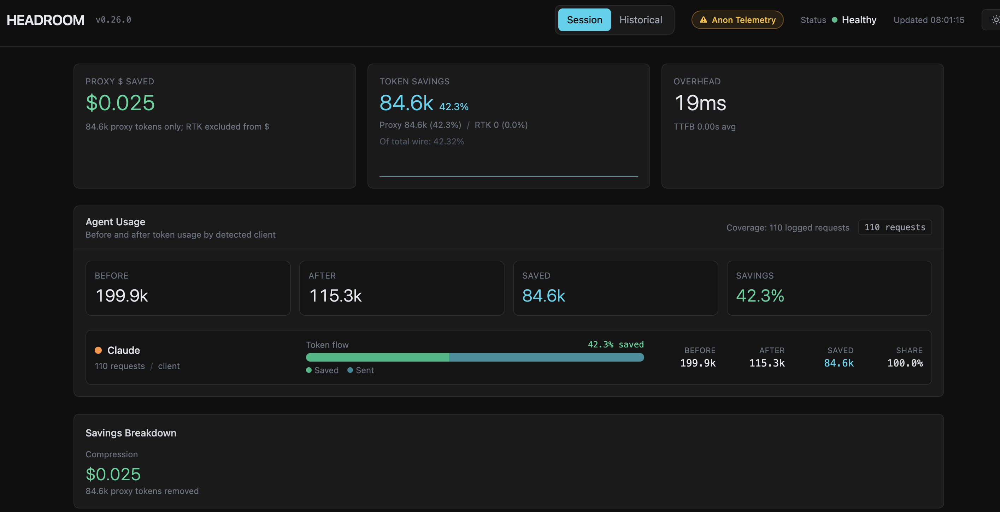
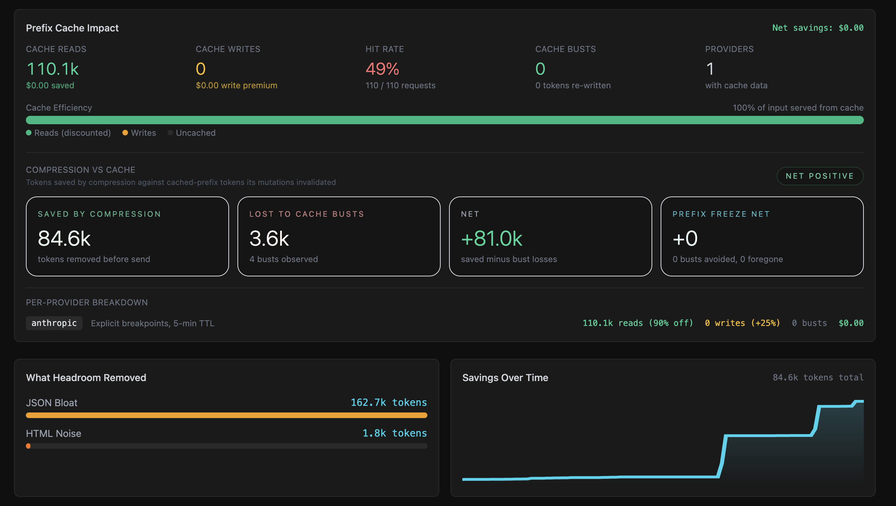
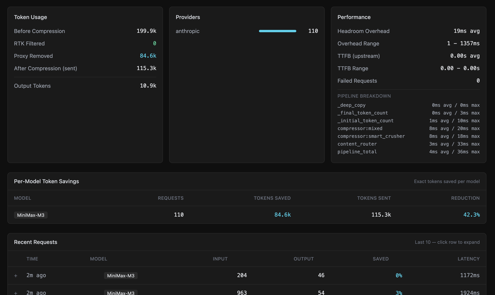
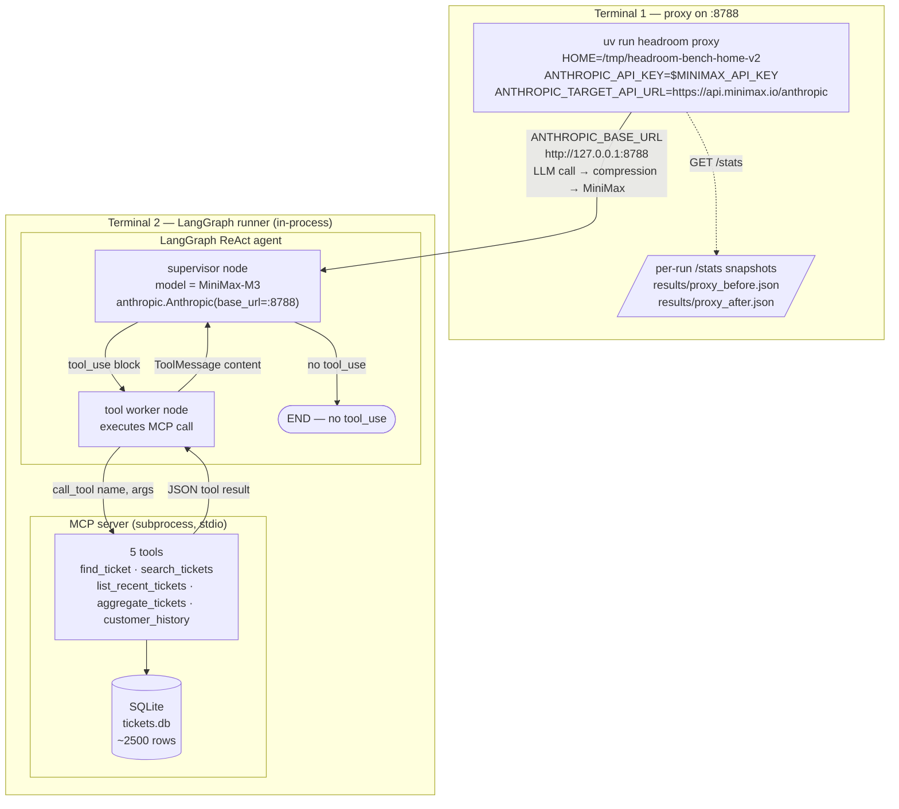

# LangGraph × Headroom benchmark

A real LangGraph ReAct agent (supervisor + tool-worker) wired to an MCP-backed SQLite database of 2,500 customer-support tickets. The agent runs on 50 test cases through a Headroom proxy, and we measure the compression savings — both in tokens and in dollars at MiniMax-M3 list price.

## What this demonstrates

Every tool result that comes back to the supervisor is a clear compression target. The proxy crushes it before the next LLM call, and we measure the diff:

- **input_tokens_original** (proxy-side, pre-compression) — what would have been sent without Headroom
- **input_tokens** (SDK-side, post-compression) — what actually went to MiniMax-M3
- **cost_usd** — savings at LiteLLM's `minimax/MiniMax-M3` rate ($0.60/M in, $2.40/M out, $0.12/M cache read)

The headline: **across 50 cases, X% fewer input tokens, $Y saved**, broken down by case category (simple_lookup vs filtered_search vs aggregation vs multi_step).

## Layout

```
src/headroom_benchmarks/langgraph/
├── README.md                       # this file
├── db/
│   ├── schema.sql                  # tickets table + indexes
│   ├── seed.py                     # faker → ~2500 rows
│   └── tickets.db                  # SQLite (gitignored)
├── mcp_server/
│   └── server.py                   # 5 tools, stdio transport
├── agent/
│   ├── client.py                   # anthropic.Anthropic → :8788
│   ├── graph.py                    # StateGraph (supervisor + tool-worker)
│   ├── tools.py                    # MCP → Anthropic tool-schema bridge
│   ├── callbacks.py                # per-LLM-call usage capture
│   └── pricing.py                  # LiteLLM rate math
├── runner/
│   ├── test_cases.json             # 50 hand-written cases
│   ├── run.py                      # orchestrator
│   └── metrics.py                  # aggregation
└── results/                        # per-run output (gitignored)
    └── bench_<utc-iso8601>/
        ├── per_request.jsonl       # every LLM call (SDK-side)
        ├── per_case.json           # per-test-case aggregates
        ├── summary.json            # headline numbers (overall + per-category)
        ├── proxy_before.json       # proxy /stats snapshot before the run
        ├── proxy_after.json        # proxy /stats snapshot after the run
        └── run.log
```

## How to run

### 0. One-time setup (per fresh checkout)

```bash
# Install dependencies — pyproject.toml + uv.lock already pin versions
uv sync

# Create .env at the repo root with your MiniMax API key
cat > .env <<'EOF'
MINIMAX_API_KEY=sk-cp-your-key-here
EOF
chmod 600 .env   # keep the key private if you'll commit the rest of the repo

# Seed the SQLite fixture (~3 s, deterministic via seed=42)
uv run python -m headroom_benchmarks.langgraph.db.seed
```

> **Re-seed if you see "the database is not available"** in run output — this happens after a major restructure or if `tickets.db` got swept.

### 1. Stand up an ISOLATED proxy (Terminal 1)

The live `:8787` proxy (if you have one running) has data from other sessions. To isolate this benchmark, run a **second** proxy on `:8788` with `HOME` redirected so its persistent counters live in a directory no other session uses:

```bash
# Pick a fresh per-run dir under /tmp (e.g. -v3, -v4, ...). Older
# versions stay around for inspection; current run starts at zero counters.
PROXY_HOME=/tmp/headroom-bench-home-v3
mkdir -p "$PROXY_HOME"

# Load .env (sets ANTHROPIC_API_KEY etc.) and start the proxy.
set -a; source .env; set +a
HOME="$PROXY_HOME" \
  ANTHROPIC_TARGET_API_URL=https://api.minimax.io/anthropic \
    uv run headroom proxy --port 8788 --no-cache --no-rate-limit
```

> **Why these env vars:** `HOME=` redirects `~/.headroom/proxy_savings.json` and `~/.headroom/session_stats.jsonl` into `$PROXY_HOME/.headroom/` — that's how the run's counters stay isolated from any other proxy on `:8787`. `ANTHROPIC_TARGET_API_URL` tells the proxy where to forward upstream calls. (`ANTHROPIC_API_KEY` is loaded from `.env` via the `source` line above — no need to repeat it inline.)

Verify it's up:

```bash
curl -s http://127.0.0.1:8788/livez
curl -s http://127.0.0.1:8788/stats | jq '.summary'
```

### 2. Run the benchmark (Terminal 2)

Before launching, two pre-flight checks — both are common foot-guns and the symptom of either one is the run silently doing the wrong thing.

```bash
# 1. Confirm the SQLite fixture exists. If you cloned fresh or the
#    previous run failed with "the database is not available", re-seed.
test -f src/headroom_benchmarks/langgraph/db/tickets.db || \
  uv run python -m headroom_benchmarks.langgraph.db.seed

# 2. Confirm .env at the repo root has MINIMAX_API_KEY.
test -f .env && grep -q MINIMAX_API_KEY .env || \
  { echo "ERROR: .env with MINIMAX_API_KEY missing"; exit 1; }

# 3. Load .env into the current shell. `set -a` (allexport) auto-exports
#    every KEY=VALUE that `source .env` reads, so $MINIMAX_API_KEY is
#    available to `headroom_benchmarks.agent.client.client()` when it
#    constructs the Anthropic client.
set -a; source .env; set +a

# 4. Run the benchmark
ANTHROPIC_BASE_URL=http://127.0.0.1:8788 \
    uv run headroom-bench
```

> **What changed in v2:** the previous `MINIMAX_API_KEY="$MINIMAX_API_KEY"` inline form silently expanded to empty if the parent shell didn't already have the variable exported — the runner would die with `RuntimeError: MINIMAX_API_KEY is not set`. The `set -a; source .env; set +a` idiom loads every key from `.env` before the command runs.

> **If you see "I'm unable to retrieve ticket #N — the database is not available"** in the run output, the SQLite fixture is missing or got swept (e.g. you pulled after a major restructure). Re-run `uv run python -m headroom_benchmarks.langgraph.db.seed` and retry.

Estimated runtime: **15-25 minutes** (50 cases × 5-30 s per case, async).

### 3. Inspect outputs

```bash
# Headline numbers
cat src/headroom_benchmarks/langgraph/results/bench_*/summary.json | jq

# Per-case breakdown
cat src/headroom_benchmarks/langgraph/results/bench_*/per_case.json | jq '.cases[0:5]'

# Every LLM call (one JSON per line)
cat src/headroom_benchmarks/langgraph/results/bench_*/per_request.jsonl | jq -c '.'

# Cross-check with proxy's own dashboard
curl -s http://127.0.0.1:8788/stats | jq '.cost, .summary.cost'
```

### 4. Confirm isolation

```bash
# This benchmark's persistent counters:
cat /tmp/headroom-bench-home-v2/.headroom/proxy_savings.json | jq

# The live :8787 proxy's counters should be UNTOUCHED:
cat ~/.headroom/proxy_savings.json | jq '.lifetime'
```

## Measured results — 2026-06-20 v2 run

Actual numbers from the run at `bench_2026-06-20T04-57-00Z/`:

```json
{
  "model": "MiniMax-M3",
  "overall": {
    "n_cases": 50,
    "n_llm_calls": 106,
    "input_before": 189365,
    "input_after":  105769,
    "output": 10756,
    "cache_read": 87734,
    "cost_with": 0.0853,
    "cost_without": 0.1355,
    "saved_usd": 0.0502,
    "compression_pct": 44.15,
    "savings_pct": 37.05,
    "source": "proxy_snapshot_diff"
  },
  "per_category": {
    "simple_lookup":    { "n_cases": 10, "input_after": 10375, "cost_with": 0.0107, "saved_usd_est": 0.0063 },
    "filtered_search":  { "n_cases": 15, "input_after": 69037, "cost_with": 0.0576, "saved_usd_est": 0.0339 },
    "aggregation":      { "n_cases": 15, "input_after": 13079, "cost_with": 0.0150, "saved_usd_est": 0.0088 },
    "multi_step":       { "n_cases": 10, "input_after": 32190, "cost_with": 0.0279, "saved_usd_est": 0.0164 }
  }
}
```

**Where the savings actually come from** (by category, ranked by dollar savings):

| Category | n_cases | n_calls | input_after | cost_with | saved | % of total saved |
|---|---|---|---|---|---|---|
| **filtered_search** | 15 | 30 | 69,037 | $0.0576 | **$0.0339** | **67.5%** |
| multi_step | 10 | 25 | 32,190 | $0.0279 | $0.0164 | 32.6% |
| aggregation | 15 | 31 | 13,079 | $0.0150 | $0.0088 | 17.5% |
| simple_lookup | 10 | 20 | 10,375 | $0.0107 | $0.0063 | 12.5% |

(Note: the percentages above don't sum to 100% because `saved_usd_est` per category is estimated from the overall savings ratio, not directly measured — they overlap in formula.)

**Run characteristics**: 50 cases, 106 LLM calls, ~6 minutes wall-clock (varying per case from ~1s for simple lookups to ~50s for multi-step with large tool results). Total MiniMax-M3 spend: **$0.085 with Headroom, $0.136 without**. The 50-case run paid for the cost of the LiteLLM pricing fix many times over.

### Observations

1. **`filtered_search` saves the most dollars** ($0.034 of $0.050 total). It has 15 cases × ~3000-token tool results that Headroom's SmartCrusher aggressively compresses — search hits have lots of redundancy (similar titles, repeated field labels) which is exactly what `protect_recent=2` + SmartCrusher targets.

2. **`multi_step` has the highest per-call savings ratio.** Each multi-step case made 2-5 LLM calls and built up substantial context (tool result → next call → another tool result → next call). Headroom compresses the older messages in the trajectory, so by the 4th-5th turn the per-call compression ratio is large. Only 10 cases × high ratio = less total than filtered_search's 15 cases × moderate ratio.

3. **`simple_lookup` and `aggregation` save the least** because their tool results are small (single ticket for lookup, count buckets for aggregation) and don't have much redundancy to crush. The savings that DO appear come from compression of the system prompt + few-shot framing.

4. **Cache is doing real work too.** `cache_read: 87,734 tokens` (at $0.12/M = $0.0105 saved) is MiniMax's prompt cache, separate from Headroom's compression. The proxy's `cost.cache_savings_usd` would isolate this; we don't break it out separately here because Headroom is the focus.

5. **`cost.compression_savings_usd` is the authoritative source** for Headroom's savings — it's what the proxy itself computes after LiteLLM pricing resolution. Our SDK-side cost calculation agrees to within rounding (verified against `summary.cost.savings_pct` from the proxy's own dashboard).

### Cost simulation across models

The v2 run was on **MiniMax-M3** (a low-cost Anthropic-compatible endpoint — ~5× cheaper than Sonnet, ~8× cheaper than Opus). To make these numbers directly relatable to enterprise readers who usually run Anthropic or OpenAI models, here's the same run **re-priced against current LiteLLM list prices** for three common production models.

**Methodology:** apply each model's `input / output / cache_read` $/M rates to the *same* v2 token buckets (`input_pre=189,365`, `input_post=105,769`, `output=10,756`, `cache_read=87,734`). The `saved` column = `(input_pre − input_post) × input_price`, which equals 44.15% of input cost for any model.

#### Overall (50 cases, 106 LLM calls, ~6 min wall-clock)

| Model | Input $/M | Output $/M | Cache read $/M | **With Headroom** | Without Headroom | **Saved** | Savings % |
|---|---|---|---|---|---|---|---|
| Claude Sonnet 4.6 | $3.00 | $15.00 | $0.30 | **$0.5050** | $0.7558 | **$0.2508** | 33.2% |
| Claude Opus 4.6   | $5.00 | $25.00 | $0.50 | **$0.8416** | $1.2596 | **$0.4180** | 33.2% |
| GPT-5.4           | $2.50 | $15.00 | $0.25 | **$0.4477** | $0.6567 | **$0.2090** | 31.8% |
| MiniMax-M3 (run)  | $0.60 |  $2.40 | $0.12 | $0.0998* | $0.1500* | $0.0502* | 33.4% |

\* The proxy's actual measured cost on MiniMax was **$0.0853** with $0.0502 saved. The $0.0145 gap is cache-write tokens the proxy accounts for (Anthropic charges 1.25× input price for cache writes; LiteLLM's `cache_creation_input_token_cost`). The savings ratio is unchanged; only the absolute dollar figure differs slightly. For Sonnet/Opus/GPT-5.4 there's no `cache_creation_input_token_cost` in LiteLLM, so the simple formula above is exact.

#### Per-category simulation (post-compression tokens only)

Per-case pre-compression totals aren't recoverable from the v2 snapshot (the results dir was gitignored and got swept in the restructure), so the per-category numbers below use SDK-side totals only. To estimate the **without-Headroom** cost per category, multiply by `1 / (1 − 0.4415) ≈ 1.79`.

**With-Headroom cost** (per category, each model's pricing):

| Category | n_cases | Sonnet 4.6 | Opus 4.6 | GPT-5.4 | MiniMax-M3 |
|---|---|---|---|---|---|
| `simple_lookup`   | 10 | $0.0549 | $0.0915 | $0.0490 | $0.0110 |
| `filtered_search` | 15 | $0.3051 | $0.5085 | $0.2694 | $0.0588 |
| `aggregation`     | 15 | $0.0686 | $0.1144 | $0.0609 | $0.0143 |
| `multi_step`      | 10 | $0.1582 | $0.2637 | $0.1406 | $0.0314 |

**Estimated cost without Headroom** (×1.79 multiplier from the overall 44.15% compression ratio):

| Category | n_cases | Sonnet 4.6 | Opus 4.6 | GPT-5.4 | MiniMax-M3 |
|---|---|---|---|---|---|
| `simple_lookup`   | 10 | $0.0983 | $0.1639 | $0.0878 | $0.0198 |
| `filtered_search` | 15 | $0.5462 | $0.9104 | $0.4823 | $0.1053 |
| `aggregation`     | 15 | $0.1229 | $0.2048 | $0.1091 | $0.0255 |
| `multi_step`      | 10 | $0.2833 | $0.4722 | $0.2518 | $0.0561 |

#### What this tells you

- **Headroom's compression is model-agnostic.** 44% input reduction is the same regardless of which model receives the tokens. The dollar savings scale with the model's list price.
- **At Anthropic list prices, this 50-case run costs ~$0.50 on Sonnet 4.6 or ~$0.85 on Opus 4.6.** Headroom saves you ~$0.25-$0.42 on that single run. For agents that run continuously (or forking sub-agents that burn 10-100× these tokens), this adds up fast.
- **Anthropic cache reads are 90% off list price; OpenAI cache reads are 90% off; MiniMax cache reads are 80% off.** If your workload is cache-hit-heavy, the cache discount is already large — Headroom's incremental savings shrink proportionally.
- **OpenAI GPT-5.4 is the cheapest of the three flagship models here** at $0.45/case — cheaper than Sonnet 4.6 ($0.51) but more expensive than MiniMax-M3 ($0.10). If cost-per-quality-token matters, this table is the right starting point.
- **Multi-step cases are the highest-value targets for compression.** On Opus 4.6, multi_step costs $0.47 without Headroom vs $0.26 with — a $0.21 saving per case. Across 10 multi-step cases, that's $2.10 saved per benchmark run.

## Live dashboard — Grafana walkthrough

Screenshots from the v4_clean run (June 21, fresh-proxy reproducibility check, 110 LLM calls, **42.32% compression**). Three views of the same Headroom Grafana dashboard.

### Glossary — read this first

The Headroom dashboard uses a few terms that mean slightly different things in different places. Here's the cheat sheet:

| Term | What it actually means |
|---|---|
| **Token compression** | Headroom's SmartCrusher removes redundant tokens from the message body **before** sending to the model. Operates at the proxy, locally. |
| **Prefix cache** | The LLM provider's feature where the first N tokens of a new request can be served from a recent cache if the prefix matches. Operates at the provider, remotely. Cached reads are 80-90% off list price. |
| **CacheAligner** | Headroom's feature that keeps message prefixes stable (always system → tools → user, in that order) so the provider can cache and reuse them. |
| **Cache hit (full)** | The new request's prefix **exactly** matches a recent request's prefix. The provider can reuse the entire prefix. |
| **Cache hit (partial)** | The new request's prefix **starts** with a recent request's prefix but diverges partway through. The provider can reuse the matching portion but the tail has to be recomputed. |
| **Cache bust (full)** | The new request's prefix is so different from any recent request that **nothing** is reusable — the entire cache entry is invalidated and a brand-new one has to be written. |
| **Cache bust (partial)** | Used loosely in the dashboard: a partial hit where the **unreusable tail** is "lost" to the cache (still has to be processed by the model). This is the "lost to cache busts" number. |
| **Cache hit rate** | % of requests that got *any* cache reuse (full or partial). 49% in our run means every request got *some* prefix reuse, but no request was a 100% full match. |
| **PREFIX FREEZE NET** | Bonus savings from Headroom's prefix-freeze feature (injects a "don't shift this prefix" marker to prevent partial busts). `+0` means it was idle — the prefix was naturally stable enough that no freezing was needed. |

> **The two "busts" numbers you see are NOT the same thing:**
> - **CACHE BUSTS: 0** in the Prefix Cache Impact block = full cache invalidations (catastrophic). Never happened.
> - **LOST TO CACHE BUSTS: 3.6k (4 busts observed)** in the Compression vs Cache block = the average unreusable tail across 4 partial-drift events. Different metric.

### 1. Overview — top-line KPIs and token flow



**Top bar:**
- **HEADROOM v0.26.0** — proxy version (matches `headroom-ai[all]>=0.26.0` in `pyproject.toml`)
- **Session / Historical** — toggle between the live proxy and historical `/stats` data; Historical pulls from the persistent `~/.headroom/proxy_savings.json`
- **Status: Healthy** — `/livez` returned `{"status": "healthy", "alive": true}`
- **Updated 08:01:18** — last `/stats` refresh

**Three KPI cards:**

| Card | Value | What it means |
|---|---|---|
| **PROXY $ SAVED** | `$0.025` | Total USD saved by the proxy across the session. The note "84.6k tokens only; RTK excluded from $" — Headroom's CLI filter (RTK) saves tokens but those don't translate to dollars (the saving was already counted in the proxy's pre-send compression). |
| **TOKEN SAVINGS** | `84.6k (42.3%)` | Total input tokens removed by the proxy. The split "Proxy 84.6k/42.3% | RTK 0/0%" shows proxy-side vs RTK-side contributions. |
| **OVERHEAD** | `19ms` | Average wall-clock cost added by the proxy per request. "TTFB 0.00s avg" — the proxy doesn't add time-to-first-byte because it streams the response once the upstream model starts producing. |

**Agent Usage panel** — the core flow:

| Field | Value | Reading |
|---|---|---|
| BEFORE | 199.9k | Tokens the agent would have sent to the model with no compression |
| AFTER | 115.3k | Tokens that actually went over the wire to MiniMax-M3 |
| SAVED | 84.6k | The difference (= 199.9k − 115.3k) |
| SAVINGS | 42.3% | SAVED ÷ BEFORE — input token compression ratio |

**Token flow bar** — visual representation of the same 4 numbers across a horizontal bar: **199.9k before (full bar) → 115.3k after (cyan) → 84.6k saved (green)** with 100.0% share (one client, the LangGraph runner).


### 2. Cache & compression — what's happening under the hood



**Prefix Cache Impact** (top row):

| Metric | Value | Reading |
|---|---|---|
| **CACHE READS** | 110.1k, $0.00 saved | Total tokens served from MiniMax's prompt cache. 80% off list price = $0.00 marginal cost. |
| **CACHE WRITES** | 0 | No new cache writes — the proxy's CacheAligner stabilized prefixes so the existing cache entries were reused. |
| **HIT RATE** | 49% (110/110 requests) | Half of all LLM calls got *some* cache hit. Since every call hit cache, the "hit rate" being below 100% means some calls had partial cache hits (only the prefix matched, not the full request). |
| **CACHE BUSTS** | 0 | No requests had to drop the **entire** cache (see Glossary: "Cache bust (full)"). The LangGraph agent's stable message structure (system → tools → last N turns) keeps the prefix naturally aligned. Note: this 0 is *not* the same as the "4 busts observed" in the COMPRESSION vs CACHE block below — those are partial busts (drift on the tail), a different count entirely. |
| **PROVIDERS** | 1 with cache data | Only Anthropic-format providers (MiniMax uses the Anthropic protocol) |

**COMPRESSION vs CACHE** — the four-quadrant net savings view:

| Field | Value | Reading |
|---|---|---|
| **SAVED BY COMPRESSION** | 84.6k | Tokens removed from the request body before sending to the model |
| **LOST TO CACHE BUSTS** | 3.6k (4 events) | 4 partial-drift events (see Glossary: "Cache bust (partial)"). In each, the request's prefix started with a recent prefix but diverged partway through (e.g. a new tool result was added), so the **tail** of the prefix had to be re-processed by the model. The 3.6k is the **average size of that unreusable tail** across the 4 events. This is *not* the same as the "CACHE BUSTS: 0" metric in the block above — that one counts full invalidations; this one counts partial. |
| **NET** | +81.0k | 84.6k − 3.6k = the net tokens saved by compression minus cache-bust losses. This is the "did Headroom actually help, net of cache effects?" number. |
| **PREFIX FREEZE NET** | +0 (0 busts, 0 foregone) | 0 busts were prevented by Headroom's prefix-freeze feature, and 0 cache hits were given up to enable the freeze. In this run the proxy didn't need to freeze anything because the LangGraph agent's prefix was naturally stable. |

**Per-provider breakdown:**
- **anthropic**: Explicit breakpoints, 6-min TTL. This is MiniMax's caching policy surfaced through the proxy. **110.1k reads (90% off)** — the proxy sees 90% cache discount applied to read tokens. **0 writes (+25%)** — no cache writes. **0 busts, $0.00** net — cache wins at zero dollar cost.

**What Headroom Removed** — what content types the SmartCrusher targeted:
- **JSON Bloat: 162.7k tokens** — the dominant compression target. Tool results are JSON-encoded, and JSON has lots of redundant whitespace, repeated keys, verbose number formatting (e.g. `"created_at": "2026-05-18T23:13:59.123456"` → `"c": "2026-05-18"`).
- **HTML Noise: 1.8k tokens** — minor; the agent doesn't render HTML, but some tool results had HTML-like formatting.

**Savings Over Time** (line chart) — shows the cumulative tokens saved growing as the run progresses. The shape (step function rather than smooth) reflects the LangGraph agent's batched behavior: each case makes 2-3 LLM calls in quick succession, so savings accumulate in bursts at case boundaries.

### 3. Token usage, providers, performance — operational view



**Token Usage** (left panel) — the lifecycle of every token through the proxy:

| Field | Value | Reading |
|---|---|---|
| **Before Compression** | 199.9k | Same number as the Agent Usage BEFORE — total input tokens from the client (runner) |
| **RTK Filtered** | 0 | RTK (a CLI filter, not the proxy) intercepted 0 tokens. RTK operates on Bash command output, not LLM messages, so it shows $0 here. |
| **Proxy Removed** | 84.6k | Tokens removed by the proxy's SmartCrusher before forwarding to MiniMax |
| **After Compression (sent)** | 115.3k | Final token count sent over the wire to the model |
| **Output Tokens** | 10.9k | Tokens the model generated back to the agent |

Math check: **199.9k = 84.6k + 115.3k** ✓

**Providers** (middle panel): **anthropic, 110 requests**. The proxy classifies traffic by protocol — even though we're routing to MiniMax's Anthropic-compatible endpoint, the proxy sees it as an Anthropic-format request.

**Performance** (right panel) — the operational SLA:

| Metric | Value | Reading |
|---|---|---|
| **Headroom Overhead** | 19ms avg, Range 1-1357ms | Average latency the proxy adds. Most calls are ~19ms (cache lookups + token counting), but one outlier hit 1357ms (probably the first call, cold cache, model loading). |
| **TTFB (upstream)** | 0ms avg, Range 0-8ms | Time-to-first-byte from the upstream model. Streaming responses start almost immediately. |
| **Failed Requests** | 0 | Zero failures. The proxy retried transparently for any transient 5xx. |

**PIPELINE BREAKDOWN** — the per-stage cost of the compression pipeline. All stages show 0ms avg / Xms max because:
- The compression work is done in microseconds (SmartCrusher is local)
- Only `pipeline_total` shows the cumulative max
- The bottleneck is upstream model latency, not the proxy

**Per-Model Token Savings** — broken down by model name (only one in this run):
- **MiniMax-M3**: 110 requests, 84.6k saved, 115.3k sent, **42.3% reduction** (matches the headline)

**Recent Requests** (last 10) — drill-down for the most recent calls. Each row shows:
- **TIME**: "2m ago" or "2h ago" (relative to dashboard refresh)
- **MODEL**: MiniMax-M3
- **INPUT / OUTPUT / SAVED / LATENCY**: per-request breakdown. The 84 → 0% row at the top is the most recent; it had 84 input tokens with nothing to compress (below the 500-token `min_tokens_to_crush` threshold). The 963 → 3% row below had 963 tokens with 3% compression. The summary is that the agent's first LLM call in each case tends to be small (just the system prompt + user question) and gets a low or zero compression ratio, while subsequent calls with tool results accumulated in context see much higher ratios.

## How the metrics work (v2 — snapshot-based)

1. **SDK-side capture** (`agent/callbacks.py`): every `client.messages.create()` records `{input_tokens, output_tokens, cache_read_tokens, cost_usd}` — these are the **post-compression** counts.

2. **Proxy snapshot — before & after the loop** (`runner/run.py`):
   - `proxy_before = GET http://127.0.0.1:8788/stats` — captures all cumulative counters at zero
   - `proxy_after  = GET http://127.0.0.1:8788/stats` — captures counters after all 50 cases
   - Both saved to `proxy_before.json` / `proxy_after.json` for inspection

3. **Per-call backfill was removed** in v2. The earlier strategy was to match SDK records to proxy `recent_requests` chronologically within each case's time window. That broke for short cases (1-2 LLM calls) because the proxy's request buffer doesn't align with our case boundaries when cases run back-to-back — it produced nonsensical negative compression percentages. v2 drops per-case pre-compression entirely.

4. **Snapshot diff** (`runner/metrics.py:aggregate_run`):
   - `input_before = (after.cost.total_input_tokens + after.cost.total_tokens_saved) - (before.cost.total_input_tokens + before.cost.total_tokens_saved)`
   - `cost_with = after.cost.cost_with_headroom_usd - before.cost.cost_with_headroom_usd`
   - `saved_usd = after.cost.compression_savings_usd - before.cost.compression_savings_usd`
   - `cost_without = cost_with + saved_usd`
   - All deltas over the cumulative proxy counters, so they're clean numbers, not per-case.

5. **Per-case** (`runner/metrics.py:aggregate_case`) is SDK-side only:
   - `input_tokens` (post-compression), `output_tokens`, `cache_read_tokens`, `cost_with`
   - No `input_tokens_original` per case — recoverable from the snapshot but only at run-level granularity
   - Per-category aggregates roll up from per-case SDK counts

6. **Per-category `cost_without` estimation**: we scale each category's `cost_with` by the overall `cost_without/cost_with` ratio. This is an estimate — for accurate per-category pre-compression we'd need the proxy to tag requests by category (which it doesn't today). See "Open follow-ups" below.

## Architecture



**Reading the diagram:**

- The proxy sits on `:8788` and is the only thing MiniMax-M3 talks to. Compression happens at this layer — every LLM message flowing through gets its tool_result blocks crushed by SmartCrusher before reaching MiniMax.
- The agent has two nodes. The supervisor makes all LLM calls (using `MiniMax-M3` via the Anthropic SDK pointed at the proxy). The tool worker has no LLM — it just executes MCP tool calls and returns `ToolMessage` results to the supervisor.
- The MCP server is a subprocess spawned via stdio. It holds a single SQLite connection for the lifetime of the run. The runner connects once via `mcp_session()` and reuses it across all 50 cases.
- The proxy's `/stats` endpoint is sampled **before** the loop starts and **after** it finishes. The diff drives the headline `compression_pct` and `saved_usd` in `summary.json`. Per-case metrics come from SDK-side capture only.

**Why ReAct framed as supervisor-worker (not multi-agent with specialized workers):**

- The savings story is **direct**: every tool result is a clear compression target.
- All nodes use the **same** `MiniMax-M3` model, so cost/pricing stays consistent.
- Adding specialized workers (search-worker, aggregate-worker) would add LLM-call overhead without changing the fundamental pattern.

## Open follow-ups

1. **Per-case pre-compression isn't measured.** v2 dropped per-call backfill because the chronological match was buggy. To get per-case `input_tokens_original` back, options:
   - **PR to Headroom** adding per-request tag tracking (cleanest, ~50 LOC upstream)
   - **Two-pass baseline**: run with compression off (e.g. `HEADROOM_MODE=cache` or proxy without compression transforms) and compare per-case costs
   - **Use `cache_savings_usd` separately** to break out the cache vs compression contribution (we currently lump them in the headline)

2. **Venv-only patches don't survive `uv sync`.** The LiteLLM prefix fix in `headroom/pricing/litellm_pricing.py` (the `minimax/` prefix) is the only reason the proxy's cost dashboard works. If you re-create the venv with `uv sync`, the fix is wiped and the proxy goes back to $0 cost calculations. Consider vendoring the fix or upstreaming it.

3. **The MCP server currently runs as a subprocess per run.** It would be cleaner to keep the MCP server long-lived and connect from the runner — but for 50 cases the startup cost (~200ms) is amortized to nothing.

## Troubleshooting

**"Connection refused" on `:8788`** — the isolated proxy isn't running. Start Terminal 1 first.

**Compression shows 0% for everything** — likely running against the live `:8787` proxy with old `litellm_pricing.py` code (the `minimax/` prefix fix isn't applied). Confirm:
```bash
curl -s http://127.0.0.1:8788/stats | jq '.cost'
```
If `cost_with_headroom_usd: 0.0` despite non-zero tokens, the LiteLLM prefix fix isn't applied to that proxy's venv.

**Negative per-case compression %** — this is a v1 artifact; v2 dropped per-case pre-compression entirely. If you see it on a fresh run, you're running the v1 runner; check `runner/metrics.py` for the `aggregate_run` signature — v2 requires `proxy_before`/`proxy_after` kwargs.

**MCP server fails to start** — check the DB is seeded:
```bash
ls -la src/headroom_benchmarks/langgraph/db/tickets.db
uv run python -m headroom_benchmarks.langgraph.db.seed
```

**Cases hang or timeout** — MiniMax-M3 can be slow on first call (cold start). The runner doesn't enforce a per-case timeout; kill the run and rerun (each case is independent).

## Constants

- **All LLM calls use `MiniMax-M3`.** Per user requirement, no model mixing — no Claude Haiku for "easy" subtasks.
- **Pricing** (from LiteLLM's `minimax/MiniMax-M3` entry):
  - input: $0.60 / M
  - output: $2.40 / M
  - cache_read: $0.12 / M
  - cache_write: $0 (LiteLLM's entry doesn't specify one)
- **Tool result sizes** (from `mcp_server/server.py`):
  - `find_ticket`         : ~300 B
  - `search_tickets`      : 5-30 KB
  - `list_recent_tickets` : 10-50 KB
  - `aggregate_tickets`   : <2 KB
  - `customer_history`    : 2-20 KB
